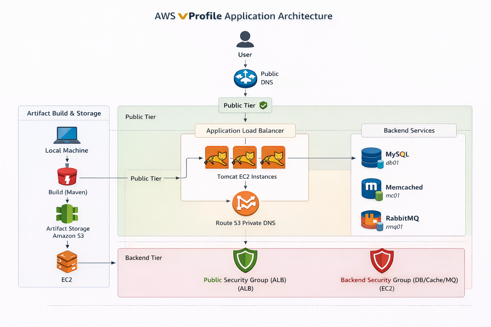

# AWS vProfile Lift & Shift Migration

## Overview

This project demonstrates the **Lift & Shift migration of a multi-tier web application (vProfile)** from a local virtualized environment to **AWS Cloud**.

The objective is to replicate a production-like system using cloud infrastructure while improving:

- Scalability
- Availability
- Cost efficiency
- Operational simplicity

The focus of this project is **infrastructure engineering and deployment**, not application development.

---

## Architecture



This architecture represents a **production-style multi-tier system** with:

- Public access via Load Balancer
- Auto Scaling application layer
- Private backend services
- DNS-based service discovery
- Artifact-based deployment

---

## Background

In a previous project, the same application stack was deployed locally using:

- Vagrant
- VirtualBox
- Shell provisioning

Repository:

```
vprofile-local-devops-stack
```

While effective for learning, local infrastructure introduces:

- Manual management overhead
- Lack of scalability
- No fault tolerance
- High operational complexity

This project transitions that setup into a **cloud-native infrastructure model**.

---

## Migration Strategy (Lift & Shift)

The migration follows a **Lift & Shift approach**:

```
Local VMs → AWS EC2 Instances
```

- No major changes to application architecture
- Infrastructure moved to AWS
- Services hosted on EC2

This enables **rapid migration with minimal refactoring**.

---

## Application Architecture

| Layer | Service | Purpose |
|---|---|---|
Web | Application Load Balancer | Entry point (HTTPS) |
Application | Apache Tomcat | Java application server |
Messaging | RabbitMQ | Message broker |
Cache | Memcached | Performance optimization |
Database | MySQL | Persistent storage |

---

## AWS Services Used

| Service | Purpose |
|---|---|
EC2 | Application and backend servers |
Application Load Balancer | Traffic distribution |
Auto Scaling Group | High availability and scaling |
S3 | Artifact storage |
Route 53 | Private DNS (service discovery) |
AWS Certificate Manager | SSL/TLS (HTTPS) |
Security Groups | Network isolation |
IAM | Secure access (user + role) |
EBS | Instance storage |

---

## Request Flow

```
User
 ↓
GoDaddy DNS (CNAME)
 ↓
Application Load Balancer (HTTPS via ACM)
 ↓
Target Group
 ↓
Auto Scaling Group (Tomcat EC2)
 ↓
Route53 Private DNS
 ↓
Backend Services (MySQL, Memcached, RabbitMQ)
```

---

## Deployment Workflow

The infrastructure was built step-by-step:

```
1. Security Groups & Keypairs
2. EC2 Instances (Backend + App)
3. Route 53 Private DNS
4. Build & Deploy Artifact (Maven + S3)
5. Application Load Balancer (HTTPS + Domain)
6. Auto Scaling Group
7. Validation
```

Each step is documented in the `/setup` directory.

---

## Repository Structure

```
aws-vprofile-lift-and-shift
│
├── README.md
│
├── architecture
│   ├── architecture.md
│   └── aws-architecture.png
│
├── setup
│   ├── 01-security-groups.md
│   ├── 02-ec2-instances.md
│   ├── 03-route53-private-dns.md
│   ├── 04-build-deploy-artifact.md
│   ├── 05-load-balancer.md
│   └── 06-autoscaling-group.md
│
└── screenshots
```

---

## Key Achievements

- Designed **multi-tier AWS architecture**
- Implemented **secure network segmentation**
- Deployed application using **artifact-based approach (S3)**
- Configured **HTTPS with custom domain**
- Built **Auto Scaling infrastructure**
- Achieved **zero dependency on single instance (self-healing)**

---

## Validation

The application is successfully accessible via:

```
https://vprofileapp.dev-dilman.online/
```

This confirms:

- Load Balancer routing is working
- Auto Scaling instances are serving traffic
- Application is fully functional on AWS

---

## Learning Outcomes

This project demonstrates:

- Cloud architecture design
- AWS networking and security
- Load balancing and scaling
- DNS-based service discovery
- Artifact-based deployment pipelines
- Real-world DevOps workflows

---

## Future Enhancements

- Infrastructure as Code (Terraform)
- CI/CD pipeline integration
- Docker containerization
- Kubernetes deployment (EKS)
- Monitoring (CloudWatch + Prometheus)

---

## Author

Dilman Sandhu  
DevOps & Cloud Engineering Learning Journey
