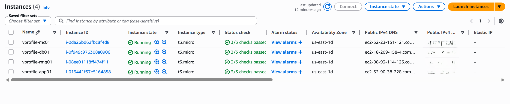
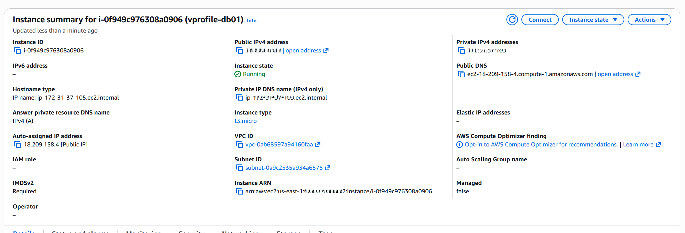
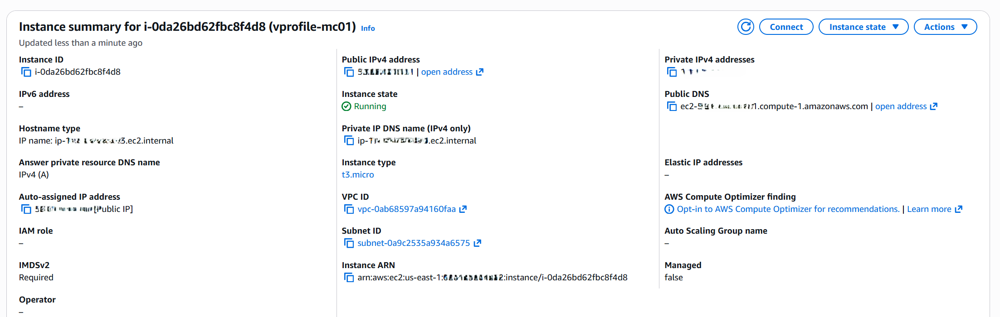
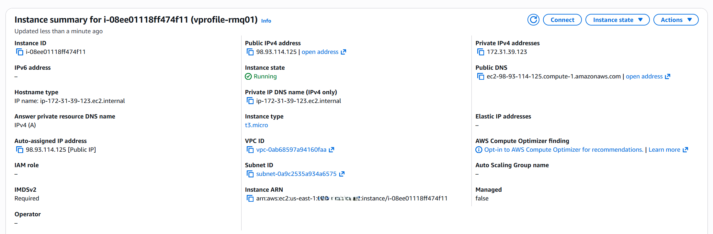
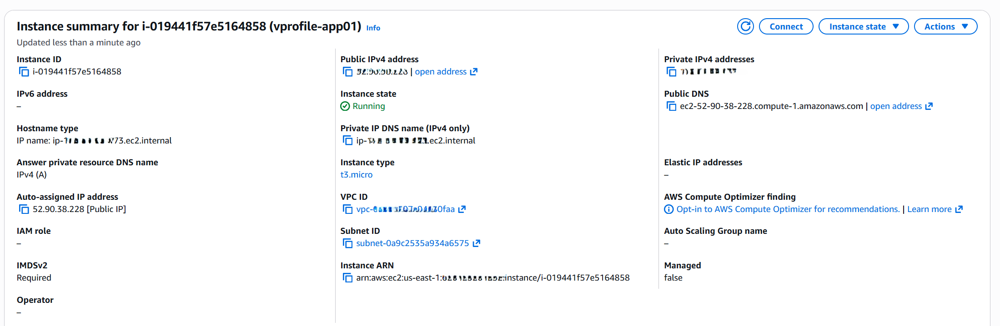

## Overview

In this step, EC2 instances were launched to host the application and backend services.

The architecture follows a multi-tier design:

- Application Layer → Tomcat
- Backend Layer → MySQL, Memcached, RabbitMQ

---

## Instances Created

The following EC2 instances were launched:

| Instance Name | Purpose | Security Group |
|---|---|---|
vprofile-db01 | MySQL Database | vprofile-backend-sg |
vprofile-mc01 | Memcached | vprofile-backend-sg |
vprofile-rmq01 | RabbitMQ | vprofile-backend-sg |
vprofile-app01 | Tomcat Application | vprofile-app-sg |

---

## AMI Used

- Backend instances: Amazon Linux
- Application instance: Ubuntu

---

## Database Instance (vprofile-db01)

MySQL (MariaDB) was installed and configured using user data script.

```bash
#!/bin/bash
DATABASE_PASS='admin123'
sudo dnf update -y
sudo dnf install git zip unzip -y
sudo dnf install mariadb105-server -y
sudo systemctl start mariadb
sudo systemctl enable mariadb
cd /tmp/
git clone -b main https://github.com/hkhcoder/vprofile-project.git
sudo mysqladmin -u root password "$DATABASE_PASS"
sudo mysql -u root -p"$DATABASE_PASS" -e "ALTER USER 'root'@'localhost' IDENTIFIED BY '$DATABASE_PASS'"
sudo mysql -u root -p"$DATABASE_PASS" -e "DELETE FROM mysql.user WHERE User='root' AND Host NOT IN ('localhost', '127.0.0.1', '::1')"
sudo mysql -u root -p"$DATABASE_PASS" -e "DELETE FROM mysql.user WHERE User=''"
sudo mysql -u root -p"$DATABASE_PASS" -e "DELETE FROM mysql.db WHERE Db='test' OR Db='test\_%'"
sudo mysql -u root -p"$DATABASE_PASS" -e "FLUSH PRIVILEGES"
sudo mysql -u root -p"$DATABASE_PASS" -e "create database accounts"
sudo mysql -u root -p"$DATABASE_PASS" -e "grant all privileges on accounts.* TO 'admin'@'localhost' identified by 'admin123'"
sudo mysql -u root -p"$DATABASE_PASS" -e "grant all privileges on accounts.* TO 'admin'@'%' identified by 'admin123'"
sudo mysql -u root -p"$DATABASE_PASS" accounts < /tmp/vprofile-project/src/main/resources/db_backup.sql
sudo mysql -u root -p"$DATABASE_PASS" -e "FLUSH PRIVILEGES"
```

---

## Memcached Instance (vprofile-mc01)

```bash
#!/bin/bash
sudo dnf install memcached -y
sudo systemctl start memcached
sudo systemctl enable memcached
sudo systemctl status memcached
sed -i 's/127.0.0.1/0.0.0.0/g' /etc/sysconfig/memcached
sudo systemctl restart memcached
sudo memcached -p 11211 -U 11111 -u memcached -d
```

---

## RabbitMQ Instance (vprofile-rmq01)

```bash
#!/bin/bash
rpm --import 'https://github.com/rabbitmq/signing-keys/releases/download/3.0/rabbitmq-release-signing-key.asc'
rpm --import 'https://github.com/rabbitmq/signing-keys/releases/download/3.0/cloudsmith.rabbitmq-erlang.E495BB49CC4BBE5B.key'
rpm --import 'https://github.com/rabbitmq/signing-keys/releases/download/3.0/cloudsmith.rabbitmq-server.9F4587F226208342.key'
curl -o /etc/yum.repos.d/rabbitmq.repo https://raw.githubusercontent.com/hkhcoder/vprofile-project/refs/heads/awsliftandshift/al2023rmq.repo
dnf update -y
dnf install socat logrotate -y
dnf install -y erlang rabbitmq-server
systemctl enable rabbitmq-server
systemctl start rabbitmq-server
sudo sh -c 'echo "[{rabbit, [{loopback_users, []}]}]." > /etc/rabbitmq/rabbitmq.config'
sudo rabbitmqctl add_user test test
sudo rabbitmqctl set_user_tags test administrator
rabbitmqctl set_permissions -p / test ".*" ".*" ".*"
sudo systemctl restart rabbitmq-server
```

---

## Application Instance (vprofile-app01)

Ubuntu instance with Tomcat installed.

```bash
#!/bin/bash
sudo apt update
sudo apt upgrade -y
sudo apt install openjdk-17-jdk -y
sudo apt install tomcat10 tomcat10-admin tomcat10-docs tomcat10-common git -y
```

---

## Service Verification

Backend services were verified after instance launch.

- MySQL (db01)
- Memcached (mc01)
- RabbitMQ (rmq01)

All services were running successfully.

---

## Screenshots

### EC2 Instances Overview



---

### Database Instance (vprofile-db01)



---

### Memcached Instance (vprofile-mc01)



---

### RabbitMQ Instance (vprofile-rmq01)



---

### Application Instance (vprofile-app01)



---

## Next Step

```
03-route53-private-dns.md
```
