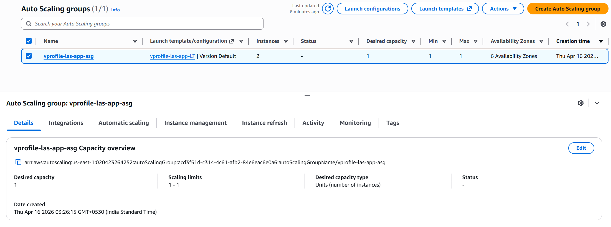

## Overview

In this step, an Auto Scaling Group (ASG) was configured to make the application highly available and scalable.

The ASG ensures that application instances are automatically created, maintained, and replaced when needed.

---

## AMI Creation

An AMI was created from the configured application instance.

```
Name: vprofile-las-app-ami
Source: vprofile-app01
```

This AMI contains:

- Tomcat installation
- Deployed application artifact
- Required configurations

---

## Launch Template

A launch template was created using the AMI.

```
Name: vprofile-las-app-LT
AMI: vprofile-las-app-ami
IAM Role: s3-admin
```

This defines how new instances will be launched.

---

## Auto Scaling Group

An Auto Scaling Group was created with the following configuration:

```
Name: vprofile-las-app-asg
Launch Template: vprofile-las-app-LT
Target Group: vprofile-las-tg
```

---

## Scaling Configuration

- Desired capacity configured
- Scaling based on CPU utilization
- SNS notifications enabled

---

## Instance Management

The original application instance was terminated:

```
vprofile-app01
```

The Auto Scaling Group now manages application instances automatically.

---

## Screenshots

### Auto Scaling Group Overview



---

## Validation

After configuring the Auto Scaling Group, the application was verified.

The application was successfully accessible using:

```
https://vprofileapp.dev-dilman.online/
```

and

```
http://vprofile-las-elf-1015430787.us-east-1.elb.amazonaws.com/
```

This confirms:

- Load Balancer is correctly routing traffic
- Auto Scaling Group instances are serving requests
- Application remains functional after replacing the original instance

---

## Result

The application is now:

- Automatically scaled based on load
- Self-healing (failed instances are replaced)
- Integrated with Load Balancer
- Accessible via HTTPS and custom domain

---

## Final Architecture

```
User
  ↓
Domain (GoDaddy)
  ↓
Application Load Balancer (HTTPS)
  ↓
Auto Scaling Group
  ↓
Tomcat Instances
  ↓
Route53 Private DNS
  ↓
Backend Services
```

---

## Completion

This completes the Lift & Shift deployment of the vProfile application on AWS.

```
End of Project
```
